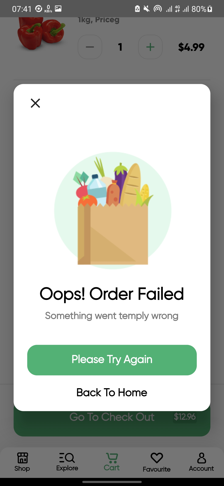

# grocery_app

A new Flutter project.

## Getting Started

This project is a starting point for a Flutter application.

A few resources to get you started if this is your first Flutter project:

- [Lab: Write your first Flutter app](https://docs.flutter.dev/get-started/codelab)
- [Cookbook: Useful Flutter samples](https://docs.flutter.dev/cookbook)

For help getting started with Flutter development, view the
[online documentation](https://docs.flutter.dev/), which offers tutorials,
samples, guidance on mobile development, and a full API reference.

------------
  
#### Flutter Version Used : 3.0.5  
#### Desing Credit : By  [Afsar Hossen](https://www.linkedin.com/in/afsar-shuvo/)  
#### Desing Files on Figma : [Online Groceries App UI](https://www.figma.com/community/file/882645007956337261)  
  
-------------  

## Screenshots  

  
   
  
  
   
  
  
   
  
  
  
  
  

