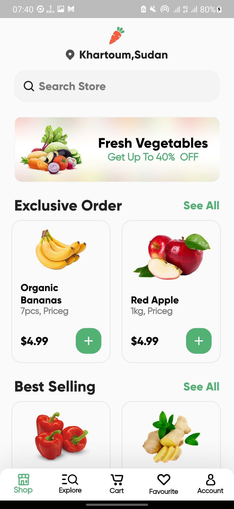
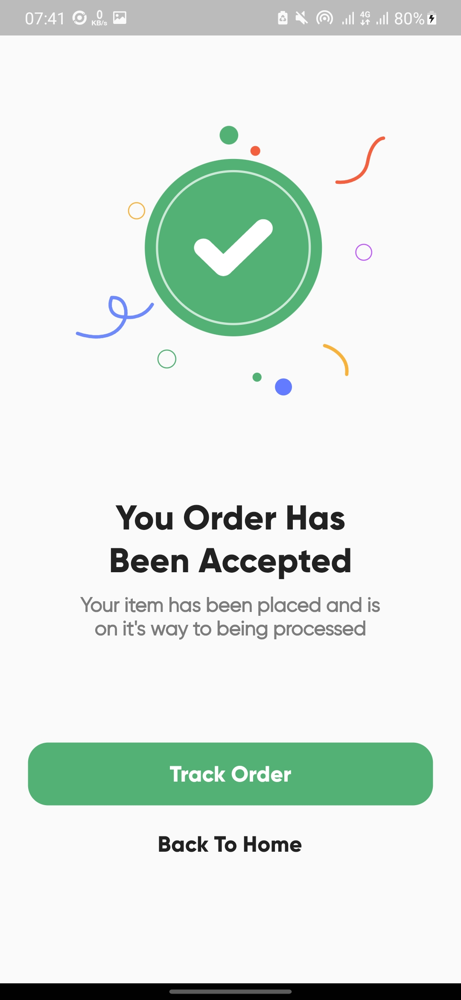

A new Flutter project.
##  Grocery_App UI

------------
  
#### Flutter Version Used : 3.0.5  
#### Desing Credit : By  [Afsar Hossen](https://www.linkedin.com/in/afsar-shuvo/)  
#### Desing Files on Figma : [Online Groceries App UI](https://www.figma.com/community/file/882645007956337261)  
  
-------------  

## Screenshots  

  
   
  
  
  
   
  
  
   
  
  
  
  
  

## Screens
- Onboarding screen
- Welcome Screen 
- Login screen 
- Home Screen(Shop)  
- Product Details Screen  
- Categories Screen (Explore)  
- Products Screen (After clicking any category)
- Filter Screen  
- My Cart Screen  
- Checkout Bottom Sheet  
- Order Failed Dialog  
- Order Accepted Screen  
- Profile Screen